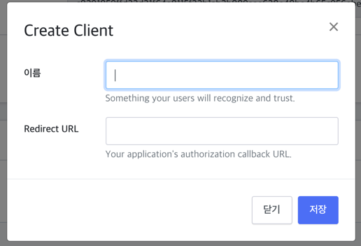
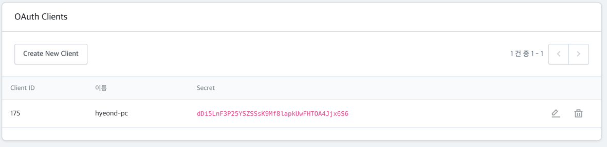

### Kollus Live VUE + Springbooot

## 빌드 환경
- Java JDK9
- SpringBoot 2.4.1
- Vue-Cli 2.6.11
- node 14.15.3
- npm 6.14.9

## 빌드전 환경설정

1. Constant 클래스의 연동 키값 입력
``` java
package net.catenoid.ticketlink.demo.constant;

import java.util.Date;

public class Constant {

    //Service Account는 VOD와 LIVE가 동일 하며 기본적인 연동 정보는
    // https://live-kr.kollus.com/preferences/service_account 페이지에서 확인
    public static final String KOLLUS_SERVICE_ACCOUNT = "";

    public static final String KOLLUS_LIVE_SECRET_KEY = "";
    public static final String KOLLUS_LIVE_USER_KEY = "";

    //http://kr.kollus.com/media/setting/service_account 페이지에서 확인

    public static final String KOLLUS_VOD_SECRET_KEY = "";
    public static final String KOLLUS_VOD_USER_KEY = "";


    //플레이어 접속 유효 시간 초단위 현재 시간부터 60초 이내에 접속 및 재생이 이루어 져야 하며
    //해당 시간 초과시 URL을 새로 생성 해야함
    public static final int EXPIRE_TIME_SECOND = 60;


    // https://live-kr.kollus.com/preferences/service_account 페이지의
    // OAuth 클라이언트 에서 사용자 생성후 생성된 정보 입력
    public static final String OAUTH_CLIENT_ID = "";
    public static final String OAUTH_CLIENT_SECRET = "";
    //scope 는 띄어쓰기로 구분 지으며 예시는 아래와 같음
    
    public static final String OAUTH_SCOPE = "";
    //빌드된 서버의 도메인이 적용된 Redirect 주소를 입력
    //live:control live:statistics live:creator creator-app-actions platform-app
    public static final String OAUTH_REDIRECT_URI = "";


    // OAuth 연동이 완료 되면 자동으로 값입력
    public static String OAUTH_ACCESS_TOKEN = "";
    public static String OAUTH_REFRESH_TOKEN = "";
    public static Date OAUTH_TOKEN_EXPIRE_TIME = new Date();


}

```
OAuth 클라이언트 생성


- 이름 : 클라이언트 명
- Redirect URL : 토큰 생성을 위한 콜백 주소(SSL 적용이 반드시 적용 되어야함)
- 예시: https://hyeond-pc.asuscomm.com/auth/code

  - Client ID : 클라이언트 아이디
  - Client Secret : 클라이언트 비밀번호
    

2. build.gradle 설정
```groovy
project.ext {
    jarBaseName = 'app'
    jarVersion = '0.0.1-' + new Date().format('yyyyMMdd_HHmmss')
}
빌드에서 생성될 jar 파일명을 지정

deploy task 이용시 ssh를 이용하여 jar 파일을 복사 및 실행가능
//원격 서버 정보 입력
remotes {
    webServer {
        host = ''
        user = ''
        password = ''
        port = 0
        knownHosts = allowAnyHosts
    }
}


task deploy {
    doLast {
        ssh.run {
            session(remotes.webServer) {
                final jarName = project.jarBaseName + "-" + project.jarVersion + ".jar"
                put from: "복사할파일 명", into: '타겟디렉토리'
                execute "ps -ef | grep app- | grep -v grep | awk '{print \"kill -9\",\$2}' | sh -v"
                execute "nohup java -jar 실행할 jar 파일명 < /dev/null > /dev/null  2> /dev/null &"
            }
        }
    }
}
Vuejs 빌드 파일은 spring의 resource 폴더로 복사됨
```


3. 초기 사용 방법
- LIVE 플랫폼의 API를 사용하기 위해서는 OAUTH를 이용한 인증이 먼저 선행 되야 함
- 실행될 서버는 SSL을 적용 해야함
- 서버 실행후 초기 https://{도메인}/auth 접속
- 리다이렉션된 페이지에서 Authorize 버튼 클릭
- https://{도메인}/ 접속

4. URL 설명
- /api/player/{live, vod} 플레이어 주소 생성 API
- /auth OAuth 인증 관련
- /callback/live 방송 상태를 콜백으로 받아 프론트 페이지로 정보 전송(Websocket)
- ws://{도메인}/ws 방송 상태 전달을 위한 웹소켓

